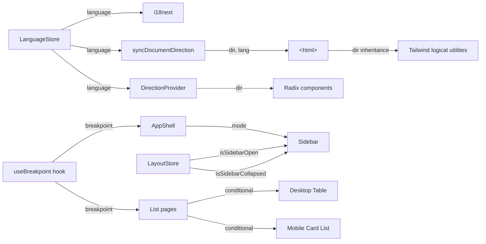

# Data Model: Global Responsive Design & Localization

**Feature**: `004-responsive-localization`
**Date**: 2026-08-25

---

This feature is entirely front-end. There are no database migrations or API contract changes.
The "data model" for this feature comprises the runtime state entities, translation file
structure, and configuration objects that govern responsive and bilingual behaviour.

## Entity: Language

**Source**: `src/constants/order-status.ts` (existing)

| Field | Type | Description |
|---|---|---|
| `language` | `'ar' \| 'en'` | The active UI language. |

**State transitions**: `ar ↔ en` (toggled by user action via `LangSwitcher`).

**Side effects on transition**:
1. `i18n.changeLanguage(lang)` — swaps active translation resource.
2. `persistLanguage(lang)` — writes to `localStorage('dashboard-language')`.
3. `syncDocumentDirection(lang)` — sets `<html dir="rtl|ltr" lang="ar|en">`.
4. Zustand `language.store` emits new value → all `useLanguageStore` subscribers re-render.

**Persistence**: `localStorage` key `dashboard-language`. Default: `'ar'`.

---

## Entity: Direction

**Source**: `src/constants/order-status.ts` (existing)

| Field | Type | Description |
|---|---|---|
| `direction` | `'rtl' \| 'ltr'` | Derived from `Language`. |

**Derivation**: `directionForLanguage(lang)` → `ar → rtl`, `en → ltr`.

**Consumers**:
- `<html dir>` (set by `syncDocumentDirection`)
- Radix `<DirectionProvider dir={direction}>` (in `providers.tsx`)
- Tailwind logical-property utilities (read `dir` from DOM ancestor)

---

## Entity: Breakpoint

**Source**: `src/hooks/useBreakpoint.ts` (NEW)

| Field | Type | Description |
|---|---|---|
| `breakpoint` | `'mobile' \| 'tablet' \| 'desktop'` | Current viewport classification. |

**Thresholds**:

| Breakpoint | Viewport Width | Tailwind Prefix |
|---|---|---|
| `mobile` | < 600 px | (default — no prefix) |
| `tablet` | 600–1024 px | `tablet:` (custom) |
| `desktop` | > 1024 px | `lg:` |

**State transitions**: Automatically derived from `window.innerWidth` via a single global
`resize` listener. Transitions emit to `useSyncExternalStore` subscribers.

**Consumers**:
- `AppShell` — sidebar mode selection
- `Sidebar` — drawer vs pinned rendering
- List pages — table vs card-list conditional rendering
- Topbar — compact vs full layout

---

## Entity: LayoutState

**Source**: `src/stores/layout.store.ts` (MODIFY)

| Field | Type | Default | Description |
|---|---|---|---|
| `isSidebarCollapsed` | `boolean` | `false` | Desktop icon-rail toggle. |
| `isSidebarOpen` | `boolean` | `false` | **NEW** — Drawer open state for tablet/mobile. |

**Methods**:

| Method | Signature | Description |
|---|---|---|
| `setSidebarCollapsed` | `(collapsed: boolean) => void` | Sets desktop collapse state. |
| `setSidebarOpen` | `(open: boolean) => void` | **NEW** — Sets drawer open state. |
| `toggleSidebar` | `() => void` | Context-aware: toggles collapse on desktop, open on tablet/mobile. |

**Validation rules**:
- `isSidebarOpen` is only meaningful when breakpoint is `tablet` or `mobile`.
- `isSidebarCollapsed` is only meaningful when breakpoint is `desktop`.
- When breakpoint transitions from tablet/mobile → desktop, `isSidebarOpen` resets to `false`.

---

## Entity: TranslationResource

**Source**: `src/lib/i18n/ar.json`, `src/lib/i18n/en.json` (MODIFY)

**Structure** (top-level namespaces):

| Namespace | Description | Est. Keys |
|---|---|---|
| `common` | Shared UI labels: save, cancel, search, loading, actions, etc. | ~30 |
| `nav` | Sidebar navigation items for all 3 roles | ~20 |
| `auth` | Login, verify, role selection | ~15 |
| `admin.dashboard` | Admin dashboard: greeting, stat cards, action cards, charts | ~25 |
| `admin.orders` | Admin orders list + detail + tracking | ~30 |
| `admin.drivers` | Admin drivers list + detail | ~20 |
| `admin.petrolCompanies` | Admin petrol companies list + detail + add form | ~25 |
| `admin.transportCompanies` | Admin transport companies list + detail + add form | ~25 |
| `admin.fuelExchange` | Admin fuel exchange list + detail | ~15 |
| `admin.notifications` | Admin notifications | ~10 |
| `admin.profile` | Admin profile sections | ~20 |
| `admin.tracking` | Admin global tracking | ~10 |
| `petrol.dashboard` | Petrol company dashboard | ~25 |
| `petrol.orders` | Petrol orders list + detail + edit + driver detail | ~30 |
| `petrol.companies` | Petrol transport companies list + detail | ~20 |
| `petrol.stations` | Stations list + owner detail + station detail + add form | ~25 |
| `petrol.fuelExchange` | Fuel exchange list + detail + new request | ~20 |
| `petrol.fuelPrices` | Fuel prices cards + edit modal | ~15 |
| `petrol.invoices` | Petrol invoices table | ~15 |
| `petrol.profile` | Petrol profile sections | ~15 |
| `transport.dashboard` | Transport dashboard | ~25 |
| `transport.orders` | Transport orders list + detail + edit + assign driver | ~35 |
| `transport.drivers` | Transport drivers list + detail + add form | ~25 |
| `transport.trucks` | Trucks and tanks page + add forms | ~20 |
| `transport.clients` | Clients list + add dialog | ~15 |
| `transport.invoices` | Transport invoices table | ~15 |
| `transport.deliveryAreas` | Delivery areas page | ~10 |
| `transport.tracking` | Transport tracking page + sidebar | ~15 |
| `transport.settings` | Settings page | ~15 |
| `transport.profile` | Transport profile sections | ~15 |
| `transport.help` | Help page: FAQ, support team, contact | ~20 |
| `transport.terms` | Terms page: sidebar + content cards | ~10 |
| `orders` | Shared order keys: status badges, common fields | ~15 |
| `drivers` | Shared driver keys | ~10 |
| `companies` | Shared company keys (existing, expanded) | ~15 |
| `invoices` | Shared invoice keys | ~10 |
| `errors` | Error messages: generic, notFound, forbidden, network | ~10 |
| `validation` | Form validation: required, minLength, email, phone | ~15 |
| **Total** | | **~700** |

**Validation rules**:
- Every key present in `ar.json` MUST have a corresponding key in `en.json` and vice versa.
- No translation value may be an empty string.
- Fallback language is `'ar'` — if an `en` key is missing, the Arabic value is shown.

---

## Relationships

